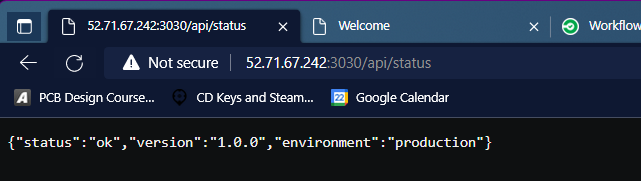
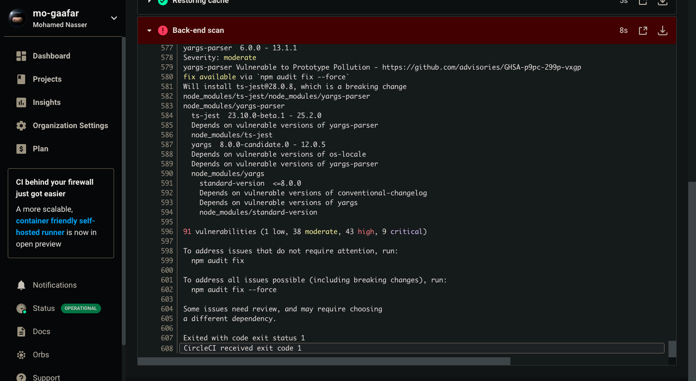

# Project 3 Submission

## Presentation PDF

[Project Presentation](Presentation.pdf)

## URLs

1. Public Url to GitHub repository [URL01]
<https://github.com/mo-gaafar/App_with_Auto-Deploy_Superpowers>

2. Evidence of deployed and functioning front-end application in an S3 bucket [URL02] 
<http://udapeople-47c6836.s3-website-us-east-1.amazonaws.com/#/employees>

- [URL02_SCREENSHOT]

    

3. Cloudfront CDN [URL03] 

- Provide a screenshot showing the evidence of deployed and functioning front-end application in CloudFront (aka, your production front-end). [URL03_SCREENSHOT]
    

4. Evidence of healthy back-end application. [URL04]

- Provide a screenshot showing the evidence of a healthy backend application. The backend endpoint status should show a healthy response. [URL04_SCREENSHOT]

5. Evidence of Prometheus Server. [URL05]

- Provide a screenshot of your Prometheus server showing UP state [URL05_SCREENSHOT]

## Screenshots

1. Job failed because of compile errors. [SCREENSHOT01]

2. Job failed because of unit tests. [SCREENSHOT02]

3. Job that failed because of vulnerable packages. [SCREENSHOT03]

4. An alert from one of your failed builds. [SCREENSHOT04]

5. Appropriate job failure for infrastructure creation. [SCREENSHOT05]

6. Appropriate job failure for the smoke test job. [SCREENSHOT06]

7. Successful rollback after a failed smoke test. [SCREENSHOT07]

8. Successful promotion job. [SCREENSHOT08]

9. Successful cleanup job. [SCREENSHOT09]

10. Only deploy on pushed to master branch. [SCREENSHOT10]

11. Provide a screenshot of a graph of your EC2 instance including available memory, available disk space, and CPU usage. [SCREENSHOT11]

12. Provide a screenshot of an alert that was sent by Prometheus. [SCREENSHOT12]

